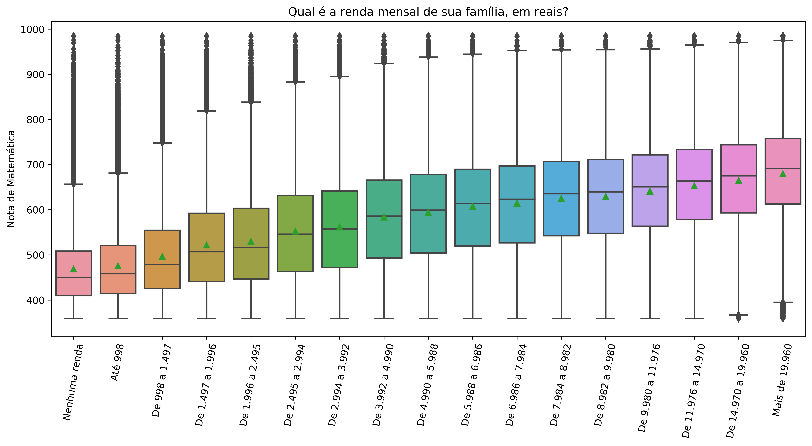

# ENEM 2019: Regressão da nota de Matemática
Esse é um projeto completo de data science: da obtenção dos dados até o deploy do modelo. É meu primeiro projeto start-to-end.
## Resumo do Projeto
* Objetivo: criar um modelo de previsão da nota da prova de Matemática do ENEM a partir de dados socioeconômicos do candidato (RMSE final ~ 93 pontos).
* Dados coletados no portal do [INEP](http://inep.gov.br/microdados).
* Análise exploratória de dados mostrou que a renda é o fator mais relevante para a previsão da nota.
* Feature engineering: criei duas features novas: uma que indica a renda per capita (por residente no domicílio) do candidato e outra que indica a escolaridade máxima entre pai e mãe.
* Benchmark model com XGBoost e LightGBM para análise de importâncias relativas entre features e feature selection.
* Refinamento do modelo: procura por hiperparâmetros ótimos usando bayesian search.
* Interpretação do modelo: expliquei quais são as decisões que o modelo faz para chegar a uma previsão. Para isso, usei valores SHAP.
* Deploy serverless do modelo no [AWS Lambda](https://aws.amazon.com/lambda/) e criação de um [bot do Telegram](https://telegram.org/blog/bot-revolution) que permite que qualquer pessoa faça a previsão da sua nota no ENEM usando nosso modelo.

## Recursos utilizados
**Python**: Versão 3.7 
**Pacotes Python**: numpy, pandas, matplotlib, seaborn, xgboost, lightgbm, hyperopt, joblib, shap 
**Serverless framework**: https://www.serverless.com/ 
**Bayesian optimization**: [[1]](https://towardsdatascience.com/automated-machine-learning-hyperparameter-tuning-in-python-dfda59b72f8a) [[2]](https://docs.aws.amazon.com/sagemaker/latest/dg/automatic-model-tuning-ex.html) 
**SHAP**: [[1]](https://medium.com/@gabrieltseng/interpreting-complex-models-with-shap-values-1c187db6ec83) [[2]](https://towardsdatascience.com/shap-explained-the-way-i-wish-someone-explained-it-to-me-ab81cc69ef30) [[3]](https://towardsdatascience.com/black-box-models-are-actually-more-explainable-than-a-logistic-regression-f263c22795d) [[4]](https://towardsdatascience.com/explain-your-model-with-the-shap-values-bc36aac4de3d)

## Obtenção dos dados
Buscamos no portal do [INEP](http://inep.gov.br/microdados) dados referentes ao ENEM 2019. Estavam disponíveis informações socioeconômicas sobre cerca de 5 milhões de candidatos, bem como as notas por eles obtidas.

Exemplos de features disponíveis:
| Feature | Tipo | Pergunta feita no questionário socioeconômico |
| --- | --- | --- |
| Q001 | categórica ordenada | Até que série seu pai, ou o homem responsável por você, estudou? |
| Q005 | numérica discreta | Incluindo você, quantas pessoas moram atualmente em sua residência? |
| Q006 | categórica ordenada | Qual é a renda mensal de sua família? (Some a sua renda com a dos seus familiares.) |
| TP_SEXO | categórica nominal | Qual é seu sexo? |
| TP_COR_RACA | categórica nominal | Qual é sua raça? |

## Data Cleaning, wrangling e feature engineering
Após carregar os dados, precisei fazer uma série de transformações para que ficassem apropriados para serem utilizados no treinamento dos modelos.
* Data type de features categóricas foram transformados de string para int.
* Candidatos sem nota na prova de Matemática foram removidos da análise (faltosos, etc).
* Eliminamos features com alto percentual de missing data (acima de 70%, em alguns casos).
* Feature engineering: criei duas features novas: uma que indica a renda per capita (por residente no domicílio) do candidato e outra que indica a escolaridade máxima entre pai e mãe.

## Análise exploratória de dados
Analisei as distribuições dos dados e suas relações com a variável dependente. Concluí que as features mais relevantes para a regressão da nota do ENEM seriam renda, escolaridade dos pais, sexo e raça do candidato (além das engineered features). Segue abaixo um exemplo de gráfico analisado.

## Benchmark e feature selection
Treinei dois modelos com hiperparâmetros default: um xgboost e um lightgbm, que apresentaram RMSE similares (~93 no conjunto de validação). A partir desses dois modelos, analisei as feature importances e discuti inconsistências existentes quando mudamos o critério para determinação das feature importances. A solução foi usar a média dos módulos dos valores SHAP para definir que features eram mais importantes. A partir desse resultado, realizei a feature selection. O model final acabou ficando com apenas 5 features.

## Refinamento do modelo
Decidi continuar a modelagem apenas com o lighgbm. Isso porque apresentou um benchmark muito parecido com o xgboost, é treinado mais rapidamente e evitaria [problemas](https://medium.com/@AlexeyButyrev/xgboost-on-aws-lambda-345f1394c2b) no deploy no AWS Lambda.

Utilizei a técnica de busca bayesiana para procurar os hiperparâmetros ótimos, com a implementação do pacote [hyperopt](https://github.com/hyperopt/hyperopt).

O modelo final mostrou RMSE de ~ 93 pontos no conjunto de teste (pontos nunca vistos antes pelo modelo, nem como validação).

## Interpretação do moelo
Para explicar quais são as decisões que o modelo toma para chegar às previsões, utilizei os valores SHAP, com a implementação da biblioteca [shap](https://github.com/slundberg/shap).
